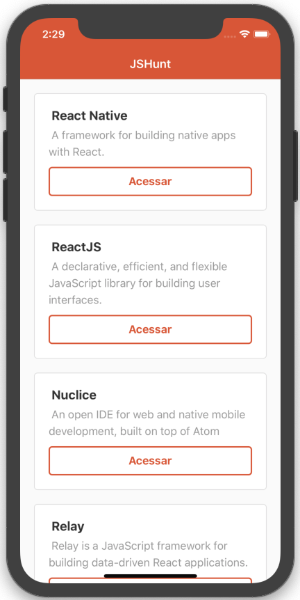
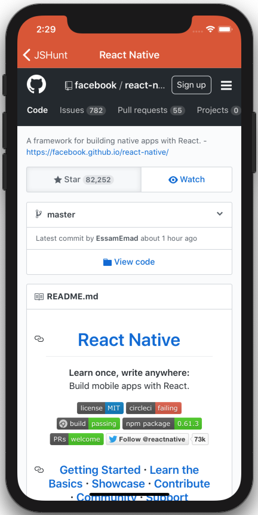
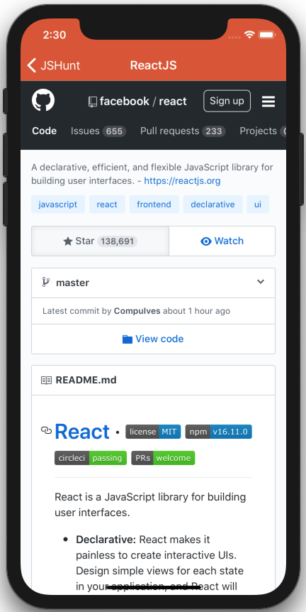
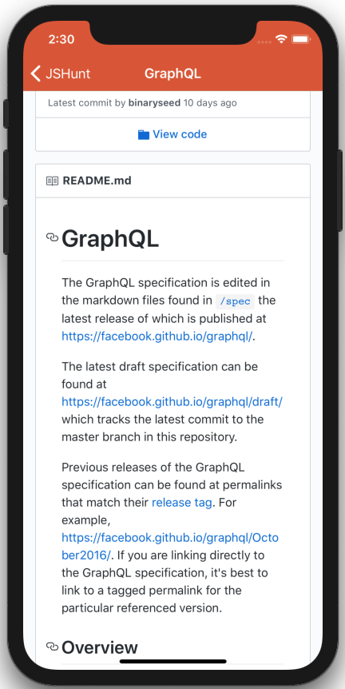

# Intro-React-Native
 Aprendendo sobre o React Native. Rocketseat. 
 Esse singelo aplicativo foi uma maneira que eu escolhi para reciclar alguns conhecimentos que possuo em React Native.
 
 
 
 # Sobre as configurações técnicas/ambiente de desenvolvimento
 A aplicativo foi desenvolvido com as seguintes tecnlogias JavaScript:
  1. NodeJS versão: 10.0
  2. HomeBrew versão mais recente (Outubro/2019)
  3. Watchman
  4. React-Native versão 0.56
  
  Ambiente de Desenvolvimento
   1. iMac
   2. Visual Code
   3. XCode 11
   
   # Bibliotecas 
    1. React Navigation (createStackNavigator)
    2. Axios 
   
   # Componentes React Native
    1. Staus Bar - Configuração de cor dos icones de status do celular, android e iOS.
    2. View; Text; FlatList; TouchableOpacity; StyleSheet
    3. WebView - Visualização dos repositorios de cada item da lista inicial. 
    4. axios - Consumo da API.
   
   # App iOS
    1. Icones.
    2. Splash Screen
    3. Nome do app.
    
  # App Android
    Configurações a serem realizadas.
   
   # Resultado
   Logo  
   
   Tela Inicio  
   
   Apresentação WebView 1  
   
   Apresentação WebView 2  
   
   Apresentação WebView 3  
   
   # Considerações Finais
   
Obrigado por você dispôr seu tempo para ler esse documento.

   
E-mail: michelvictor16@gmail.com

   
LinkedIn: https://www.linkedin.com/in/michel-c%C3%A2mara-3907a6a4/ 

   <b>Avante!</b>
   
